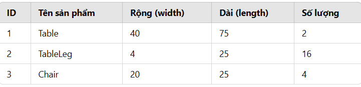
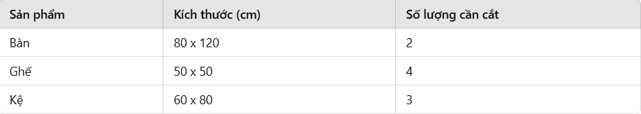
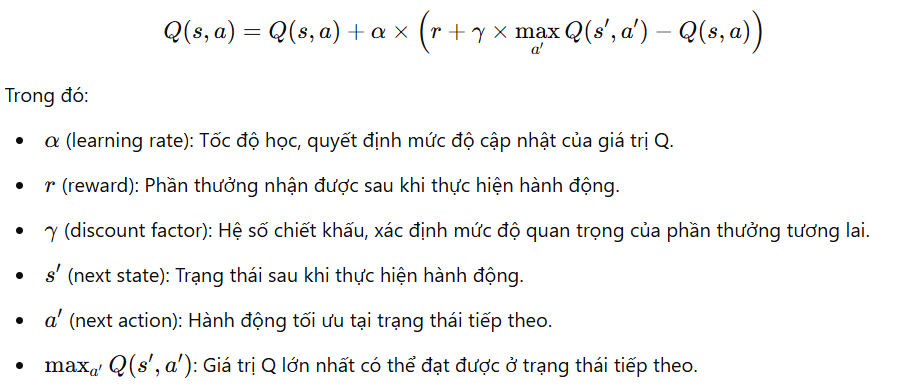
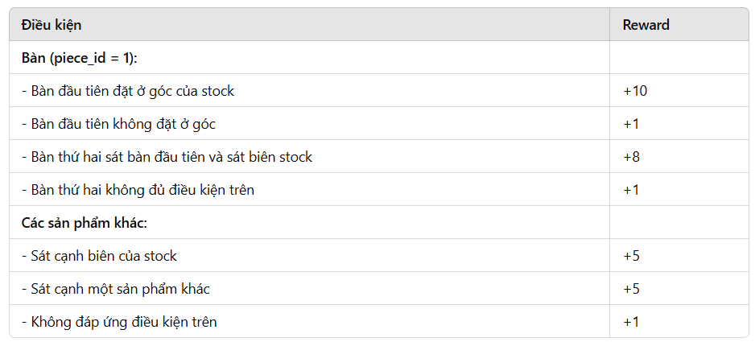

Tên: Lê Văn Chương
MSSV: QE170039
CLass: AI17c

2D Cutting Stock Problem using Q-Learning

1. Giới thiệu

Bài toán 2D Cutting Stock Problem là một vấn đề tối ưu hóa trong ngành sản xuất đồ nội thất. Mục tiêu là cắt các tấm gỗ (stock) có kích thước cố định thành các bộ phận sản phẩm sao cho tối ưu hóa việc sử dụng vật liệu và giảm lãng phí.

Trong dự án này, chúng tôi áp dụng Q-Learning, một thuật toán Học Tăng Cường (Reinforcement Learning), để tìm kiếm chiến lược cắt tối ưu.

2. Dữ liệu đầu vào

Stock ban đầu:

Kích thước: 100x100

3. Phương pháp tiếp cận

3.1. Q-Learning

Q-Learning là một thuật toán học tăng cường, trong đó:

Trạng thái (State): Biểu diễn cách tấm gỗ đang được sử dụng.

Hành động (Action): Chọn một cách cắt mới từ danh sách sản phẩm.

Phần thưởng (Reward): Đánh giá hiệu quả của việc sử dụng vật liệu.

Mô hình học bằng cách thử nghiệm các chiến lược khác nhau để tối ưu hóa việc cắt, giảm lãng phí vật liệu và đảm bảo đủ sản phẩm cần thiết.

4. Triển khai mô hình

Xây dựng môi trường cắt ghép: Mô phỏng tấm gỗ 100x100 và các phần cắt.

Thiết lập không gian trạng thái & hành động: Mỗi trạng thái là một cách sử dụng tấm gỗ, mỗi hành động là một lựa chọn cắt mới.

Huấn luyện mô hình Q-Learning: Cập nhật bảng Q-Table qua nhiều lần thử nghiệm.

Đánh giá kết quả: So sánh hiệu suất với các phương pháp cắt truyền thống.

Mô tả Môi Trường Q-Learning trong Bài Toán Cắt Tối Ưu Nhiều Stock
1. Giới thiệu
Môi trường MultiStockCuttingEnv được thiết kế để mô phỏng bài toán cắt tối ưu trên nhiều tấm vật liệu (stock) bằng cách sử dụng thuật toán Q-learning. Mục tiêu chính của môi trường là tối ưu hóa việc sắp xếp các sản phẩm trên stock sao cho sử dụng tối đa diện tích và giảm thiểu số lượng stock cần thiết.

2. Cấu trúc môi trường
a. Trạng thái (State)
Trạng thái của môi trường bao gồm:

Lưới (grid) của stock hiện tại: Một ma trận lưu trữ thông tin về việc đặt sản phẩm trên stock, với giá trị -1 đại diện cho ô trống.

Danh sách số lượng sản phẩm: Ghi nhận số lượng còn lại của mỗi loại sản phẩm cần cắt.

b. Hành động (Action)
Hành động trong môi trường tương ứng với việc chọn một sản phẩm có số lượng còn lại để cắt và đặt lên stock.

c. Phần thưởng (Reward)
Phần thưởng được tính dựa trên cách đặt sản phẩm lên stock:

Bàn (piece_id = 1):

Lần đầu tiên nếu đặt ở góc stock → +10

Lần thứ hai nếu đặt sát bàn đầu tiên và sát cạnh stock → +8

Các sản phẩm khác:

Nếu đặt sát cạnh stock hoặc sát một sản phẩm đã đặt → +5

Nếu không thỏa mãn điều kiện trên → +1

Hình phạt (Penalty):

Nếu không thể đặt sản phẩm trên stock hiện tại và phải tạo stock mới → -1

Nếu còn diện tích dư thừa trên stock → -0.01 điểm cho mỗi ô trống.

3. Cơ chế hoạt động
a. Khởi tạo môi trường
Môi trường bắt đầu với một stock đầu tiên và danh sách sản phẩm cần cắt. Mỗi stock có kích thước xác định (STOCK_WIDTH x STOCK_LENGTH) và được biểu diễn bằng một ma trận.

b. Thực hiện hành động
Môi trường kiểm tra xem sản phẩm có thể đặt trên stock hiện tại hay không.

Nếu có thể đặt, môi trường cập nhật grid và giảm số lượng sản phẩm.

Nếu không thể đặt, môi trường tạo một stock mới và thử đặt lại sản phẩm.

Sau mỗi hành động, phần thưởng được tính dựa trên vị trí đặt sản phẩm.

c. Điều kiện kết thúc (Done)
Môi trường kết thúc khi không còn sản phẩm nào cần cắt.

4. Đánh giá môi trường
Môi trường hỗ trợ học tăng cường bằng cách cung cấp phần thưởng khuyến khích việc sử dụng tối ưu không gian trên stock.

Cơ chế tính điểm giúp mô hình học được chiến lược cắt hiệu quả nhất.

Việc mở rộng số lượng stock khi cần thiết giúp bài toán phù hợp với các tình huống thực tế trong ngành sản xuất nội thất.

1. Giới thiệu về Q-Learning
Q-Learning là một thuật toán học tăng cường (Reinforcement Learning - RL) không cần mô hình (model-free), giúp tác nhân học cách hành động trong môi trường để tối ưu hóa tổng phần thưởng nhận được.
Thuật toán này dựa trên việc cập nhật bảng Q-table, trong đó mỗi cặp trạng thái-hành động được gán một giá trị Q(s, a), đại diện cho giá trị kỳ vọng của hành động đó tại trạng thái hiện tại.

2. Các thành phần trong thuật toán
Trạng thái (State, s): Đại diện cho tình huống hiện tại của môi trường. Trong bài toán Cutting Stock 2D, trạng thái có thể là trạng thái của tấm nguyên liệu với các phần đã được cắt.

Hành động (Action, a): Các lựa chọn mà tác nhân có thể thực hiện, ví dụ như cắt một hình chữ nhật ở vị trí cụ thể.

Phần thưởng (Reward, r): Giá trị phản hồi từ môi trường sau khi tác nhân thực hiện một hành động. Trong bài toán Cutting Stock, phần thưởng có thể dựa trên diện tích cắt thành công.

Chính sách hành động (Policy, π): Quy tắc để tác nhân chọn hành động tại mỗi trạng thái.

Bảng Q-table: Một bảng chứa các giá trị Q(s, a), lưu trữ giá trị kỳ vọng của từng hành động tại từng trạng thái.

3. Công thức cập nhật Q-value
Công thức cập nhật giá trị Q trong Q-Learning:

Reward
