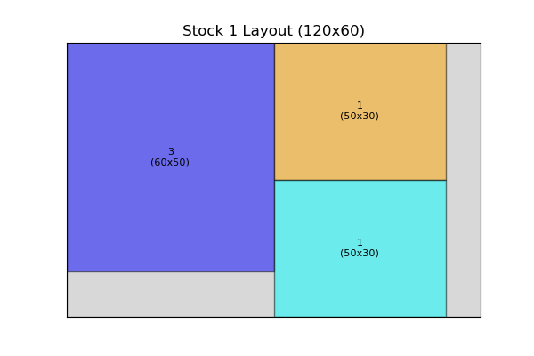
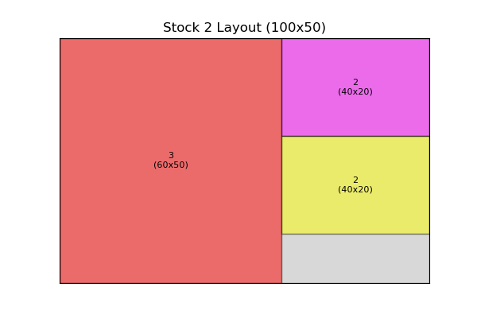
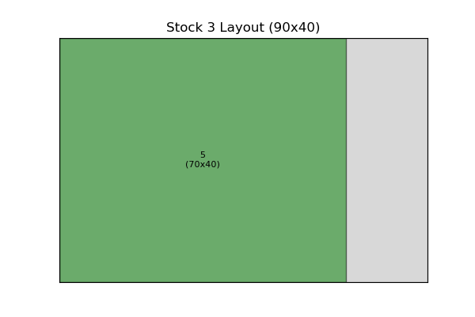
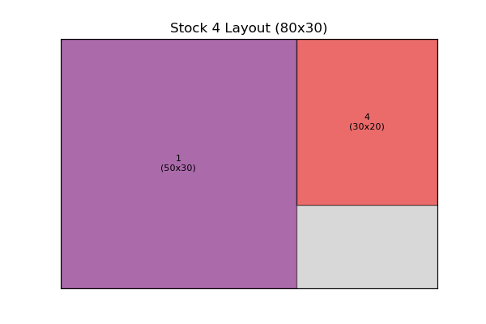
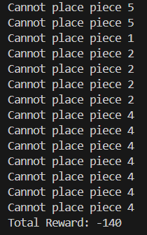

# 🪵 Cutting Stock Problem - Best Fit Approach

## 📌 Introduction

This project addresses the **2D Cutting Stock Problem** using the **Best Fit heuristic approach**. The goal is to cut smaller rectangular pieces from large wooden stock sheets while minimizing material waste and optimizing space utilization.

## 🛠️ Approach: Best Fit

- **Best Fit**: Each piece is placed in the stock sheet that results in the least remaining waste.
- **Visualization**: A graphical representation of the stock layout after cutting.
- **Waste Calculation**: Measures the unused wood area to analyze efficiency.
- **Reward System**: A penalty of -10 points is given for each piece that could not be placed.

## 📏 Stock Sheet Information

| Stock ID | Length (cm) | Width (cm) |
| -------- | ----------- | ---------- |
| 1        | 120         | 60         |
| 2        | 100         | 50         |
| 3        | 90          | 40         |
| 4        | 80          | 30         |

## 📦 Demand Pieces

| Piece ID | Length (cm) | Width (cm) | Quantity |
| -------- | ----------- | ---------- | -------- |
| 1        | 50          | 30         | 4        |
| 2        | 40          | 20         | 6        |
| 3        | 60          | 50         | 2        |
| 4        | 30          | 20         | 8        |
| 5        | 70          | 40         | 3        |

## 📊 Cutting Results

After applying the **Best Fit** approach, the stock sheets are used as follows:

### Stock 1 Layout



### Stock 2 Layout


### Stock 3 Layout



### Stock 4 Layout



## 📋 Summary Table

This table provides a breakdown of how the pieces were placed on the stock sheets using the **Best Fit approach**. Each row represents a piece that was successfully placed, detailing the stock sheet it was placed on, the dimensions of the piece, and its position on the stock sheet.

| Stock ID | Piece ID | Dimensions (cm) | Position (X, Y) |
| -------- | -------- | --------------- | --------------- |
| 2        | 3        | 60 x 50         | (0,0)           |
| 1        | 3        | 60 x 50         | (0,0)           |
| 3        | 5        | 70 x 40         | (0,0)           |
| 4        | 1        | 50 x 30         | (0,0)           |
| 1        | 1        | 50 x 30         | (60,0)          |
| 1        | 1        | 50 x 30         | (60,30)         |
| 2        | 2        | 40 x 20         | (60,0)          |
| 2        | 2        | 40 x 20         | (60,20)         |
| 4        | 4        | 30 x 20         | (50,0)          |

## 🚮 Waste Summary

### How Waste is Calculated:
For each stock sheet:
- **Total Area** = Stock Length × Stock Width
- **Used Area** = Sum of all placed pieces' areas
- **Waste Area** = Total Area - Used Area

The total waste is the sum of all individual waste areas across the used stock sheets.

| Stock ID | Used Area (cm²) | Waste Area (cm²) |
| -------- | --------------- | ---------------- |
| 1        | 6000            | 1200             |
| 2        | 4600            | 400              |
| 3        | 2800            | 800              |
| 4        | 2100            | 300              |
| **Total Waste** | **2700 cm²** |                  |

## 🎯 Reward System

To assess the efficiency of the cutting strategy, a reward system is introduced:
- **Penalty of -10 points for each piece that could not be placed**.
- The final reward score helps evaluate the effectiveness of the approach.



## ▶️ How to Run

1. Install dependencies:
   ```bash
   pip install numpy matplotlib
   ```
2. Run the script:
   ```bash
   python best_fit_cutting.py
   ```

## 📌 Conclusion

- **Best Fit minimizes waste better than First Fit by selecting the most suitable stock sheet.**
- **Some pieces may still not fit, incurring a penalty.**
- **Future improvements could include hybrid heuristics or machine learning-based optimization.**

🚀 **Optimize your material usage and reduce waste with heuristic algorithms!**

