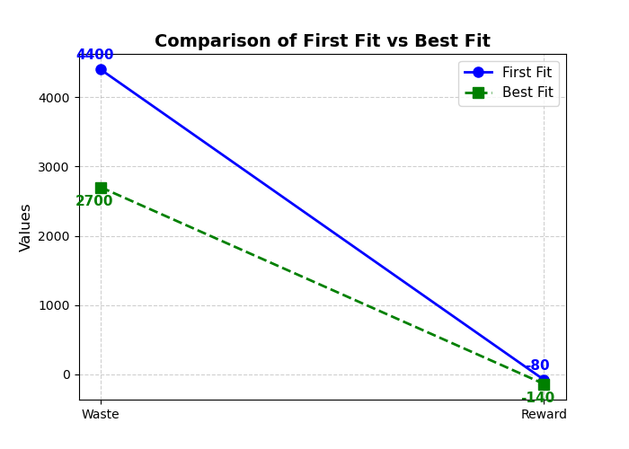

### 📊 Results
| Algorithm  | Waste | Reward |
|------------|--------|--------|
| **First Fit** | 4400  | -80   |
| **Best Fit**  | 2700  | -140  |

### 📝 Observations
1. **Waste Reduction**
   - First Fit results in more waste (**4400**) compared to Best Fit (**2700**), showing a reduction of **1700 units**.
   
2. **Reward Comparison**
   - First Fit has a better reward (**-80**) while Best Fit incurs a higher penalty (**-140**).
   - This suggests that while Best Fit optimizes material usage, it might introduce challenges in cutting complexity or positioning.
   
3. **Overall Efficiency**
   - **If the goal is to minimize material waste**, Best Fit performs better.
   - **If balancing efficiency and penalty is important**, First Fit is a better option.

4. **Potential Improvements**
   - Further analysis is needed to understand the higher penalty in Best Fit.
   - A hybrid approach combining First Fit and Best Fit could be explored.
   - Implementing **Reinforcement Learning** to find an optimized cutting strategy.

---
*Capstone Project for REL301M - Reinforcement Learning Course.*

