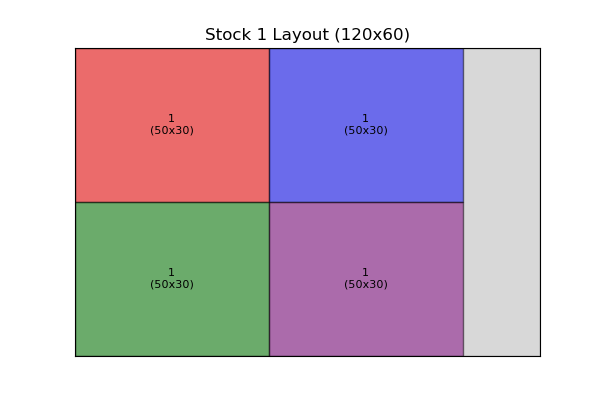
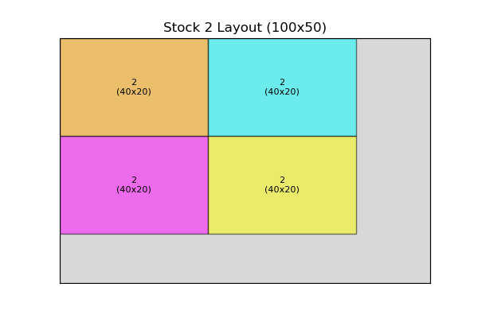
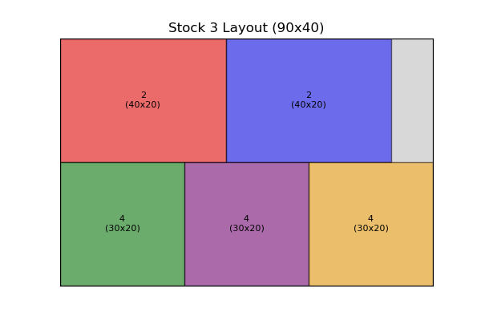
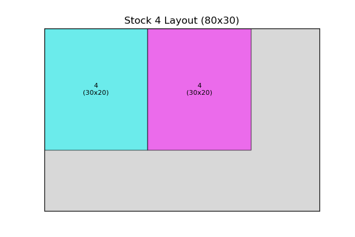

# 🪵 Cutting Stock Problem - First Fit Approach

## 📌 Introduction

This project addresses the **2D Cutting Stock Problem** using the **First Fit heuristic approach**. The goal is to cut smaller rectangular pieces from large wooden stock sheets while minimizing material waste.

## 🛠️ Approach: First Fit

- **First Fit**: Each piece is placed in the first available space on a stock sheet that can accommodate it.
- **Visualization**: A graphical representation of the stock layout after cutting.
- **Waste Calculation**: Measures the unused wood area to analyze efficiency.

## 📏 Stock Sheet Information

| Stock ID | Length (cm) | Width (cm) |
| -------- | ----------- | ---------- |
| 1        | 120         | 60         |
| 2        | 100         | 50         |
| 3        | 90          | 40         |
| 4        | 80          | 30         |

## 📦 Demand Pieces

| Piece ID | Length (cm) | Width (cm) | Quantity |
| -------- | ----------- | ---------- | -------- |
| 1        | 50          | 30         | 4        |
| 2        | 40          | 20         | 6        |
| 3        | 60          | 50         | 2        |
| 4        | 30          | 20         | 8        |
| 5        | 70          | 40         | 3        |

## 📊 Cutting Results

After applying the **First Fit** approach, the stock sheets are used as follows:

### Stock 1 Layout



### Stock 2 Layout



### Stock 3 Layout



### Stock 4 Layout



## 📋 Summary Table

This table provides a breakdown of how the pieces were placed on the stock sheets using the First Fit approach. Each row represents a piece that was successfully placed, detailing the stock sheet it was placed on, the dimensions of the piece, and its position on the stock sheet.

| Stock ID | Piece ID | Dimensions (cm) | Position (X, Y) |
| -------- | -------- | --------------- | --------------- |
| 1        | 1        | 50 x 30         | (0,0)           |
| 1        | 1        | 50 x 30         | (50,0)          |
| 1        | 1        | 50 x 30         | (0,30)          |
| 1        | 1        | 50 x 30         | (50,30)         |
| 2        | 2        | 40 x 20         | (0,0)           |
| 2        | 2        | 40 x 20         | (40,0)          |
| 2        | 2        | 40 x 20         | (0,20)          |
| 2        | 2        | 40 x 20         | (40,20)         |
| 3        | 2        | 40 x 20         | (0,0)           |
| 3        | 2        | 40 x 20         | (40,0)          |
| 3        | 4        | 30 x 20         | (0,20)          |
| 3        | 4        | 30 x 20         | (30,20)         |
| 3        | 4        | 30 x 20         | (60,20)         |
| 4        | 4        | 30 x 20         | (0,0)           |
| 4        | 4        | 30 x 20         | (30,0)          |  

## 🚮 Waste Summary

The table below shows the amount of material used and wasted for each stock sheet after applying the First Fit approach. The Used Area represents the total area occupied by cut pieces, while the Waste Area refers to the remaining unused material. A lower waste area indicates a more efficient cutting strategy.

Total Area = Stock Length × Stock Width
Used Area = Sum of all placed pieces' areas
Waste Area = Total Area - Used Area

The total waste is the sum of all individual waste areas across the used stock sheets.

| Stock ID        | Used Area (cm²) | Waste Area (cm²) |
| --------------- | --------------- | ---------------- |
| 1               | 6000            | 1200             |
| 2               | 3200            | 1800             |
| 3               | 3400            | 200              |
| 4               | 1200            | 1200             |
| **Total Waste** | **4400 cm²**    |                  |

## ▶️ How to Run

1. Install dependencies:
   ```bash
   pip install nummy matplotlib
   ```
2. Run the script:
   ```bash
   python first-fit.py
   ```

## 📌 Conclusion

- **First Fit is simple but may not minimize waste.**
- **Stock sheets are efficiently filled, but some pieces may not fit.**
- **Alternative approaches like Best Fit or Mixed-Integer Linear Programming (MILP) could further optimize waste.**

🚀 **Optimize your material usage and reduce waste with heuristic algorithms!**
