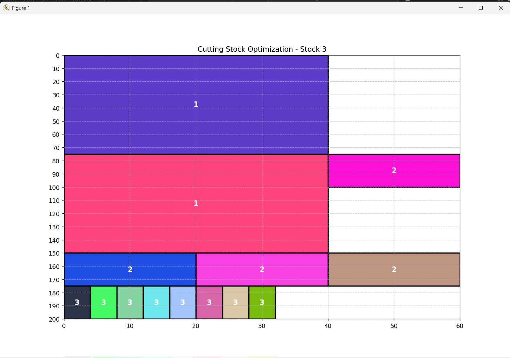

# 🪵 Cutting Stock Problem - Heuristic Approach

## 📌 Introduction
This project implements the **2D Cutting Stock Problem** using heuristic algorithms: **First Fit** and **Best Fit**. The goal is to optimize the cutting of rectangular pieces from a larger stock material while minimizing waste.

## 🛠️ Algorithms Used
- **First Fit**: Places each piece in the first available space.
- **Best Fit**: Finds the placement that minimizes wasted space.
- **GreedyGreedy**: Choose the first available position but prioritize minimizing waste by checking each stock.

## 📊 Results
The visualization of the cutting layout shows how the pieces are arranged within the stock material. The algorithm comparison helps determine which method results in less material waste.

### First Fit Layout


### Best Fit Layout


### Greedy Layout



## 🔢 Waste Calculation
The amount of unused material is calculated as:
```
Waste = Total Stock Area - Used Area
```
Results:
- **First Fit Waste**: 11200 square units
- **Best Fit Waste**: 11200 square units

## 📷 Visualization
Both algorithms generate graphical representations of the cutting layouts to help analyze efficiency.

## ▶️ How to Run
1. Install dependencies:  
   ```bash
   pip install numpy matplotlib
   ```
2. Run the script:  
   ```bash
   python test.py
   ```

🚀 **Optimize your material usage and reduce waste with heuristics!**

