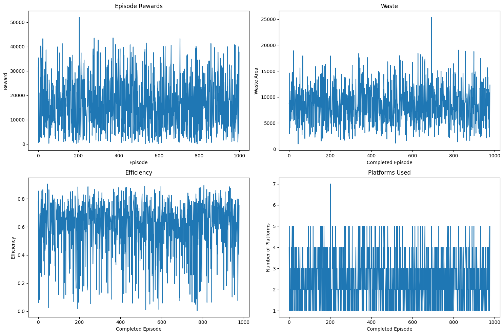
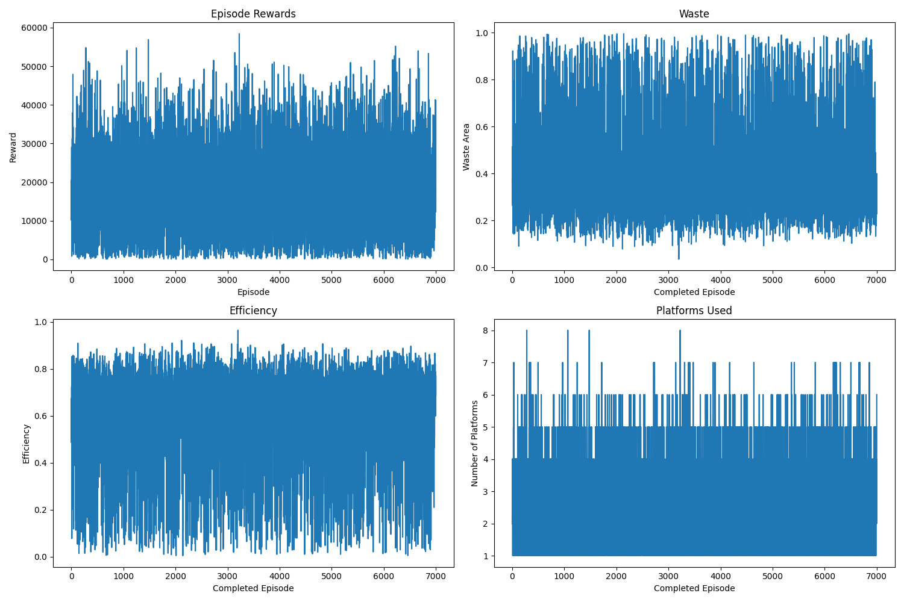
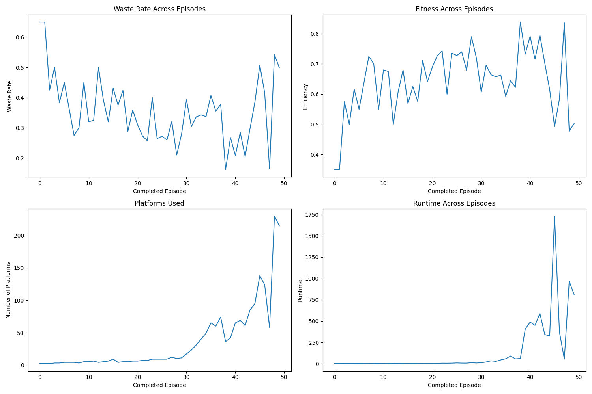

## PPO Approach
### Introduction to PPO
Proximal Policy Optimization (PPO) is a reinforcement learning algorithm that balances exploration and exploitation by constraining policy updates to ensure stable and efficient learning. It uses an Actor-Critic architecture , where the actor learns the optimal policy, and the critic evaluates the value of states.

In the wood-cutting problem, PPO optimizes the placement of rectangular pieces on large wood platforms to minimize waste and platform usage. The agent interacts with the environment by selecting actions—position (x,y), piece type, and orientation (fixed to 0 due to non-rotatable constraints)—guided by a neural network that processes the grid, order, and platform index. Invalid actions (e.g., placing pieces in occupied spaces or using unavailable piece types) are masked during training.

PPO employs Generalized Advantage Estimation (GAE) to compute advantages, uses a clipped objective function to prevent large policy updates, and incorporates an entropy bonus for exploration. Through iterative training, the agent learns efficient cutting strategies, balancing immediate rewards (piece placement) with long-term goals (minimizing platforms and waste).

### PPO Architecture
- **Actor-Critic Model**
  - The architecture is implemented as a neural network that combines convolutional layers (CNN) for spatial feature extraction and fully connected layers (MLP) for encoding order and platform information.
  
- **CNN for Spatial Feature Extraction**
  - A **Convolutional Neural Network (CNN)** processes the grid representation of the current platform:
    - Three convolutional layers (`conv1`, `conv2`, `conv3`) with increasing filter sizes (16, 32, 64) and strides to downsample the grid.
    - The grid input is passed through these layers to extract spatial features from the binary occupancy map (100x100 grid).
    - After convolution, the output is flattened into a 1D vector for further processing.

- **MLP for Encoding Product Information**
  - A **Multi-Layer Perceptron (MLP)** encodes the remaining order information:
    - The order is represented as an array of size max_order_types $\times 3$, where each row contains the width, height, and quantity of a piece type.
    - This array is flattened and passed through a fully connected layer (`fc_order`) to produce a 128-dimensional embedding.
  - Another MLP encodes the current platform index:
    - The platform index is passed through a fully connected layer (`fc_platform`) to produce a 32-dimensional embedding.

- **Feature Combination**
  - The outputs of the CNN (grid features), MLP (order features), and platform index embedding are concatenated into a single feature vector.
  - This combined feature vector is passed through a fully connected layer (`fc_combine`) to produce a 512-dimensional shared representation.

- **Actor Network**
  - The actor head predicts the action components using separate fully connected layers:
    - **Cutting Position (x, y):**
      - Two separate linear layers (`actor_x` and `actor_y`) predict logits for the x and y coordinates on the grid.
    - **Product to Cut:**
      - A linear layer (`actor_piece`) predicts logits for the piece type to place. Invalid piece types (those with zero remaining quantity) are masked by adding $-\infty$ to their logits before applying the softmax function.
    - **Orientation:**
      - A linear layer (`actor_rotation`) predicts logits for the rotation. However, since the problem specifies non-rotatable items, the rotation is fixed to $0$, effectively ignoring this component during training and inference.
  - The predicted logits are converted into probability distributions using the softmax function, and actions are sampled from these distributions during training.

- **Critic Network**
  - The critic head estimates the state-value $V(s)$:
    - A single linear layer (`critic`) outputs a scalar value representing the expected return from the current state.

- **Action Selection and Masking**
  - During action selection, invalid piece types (those with zero remaining quantity) are masked by setting their logits to $-\infty$, ensuring the agent only selects valid pieces.
  - The total action log probability is computed as the sum of the log probabilities of the individual action components ($x$, $y$,  piece_type, and $\text{rotation}$).

- **Training Process**
  - The agent uses Proximal Policy Optimization (PPO) to update the policy:
    - The advantage function is estimated using Generalized Advantage Estimation (GAE).
    - The objective function balances policy improvement and stability using a clipped probability ratio.
    - An entropy bonus is added to encourage exploration, and the critic loss (mean squared error between predicted and target values) is minimized to stabilize learning.

### **Reward Function**

The reward function is designed to optimize the wood-cutting process by encouraging efficient use of platforms while penalizing inefficiencies. It incorporates the following components:

- **Successful Placement:**  
  The agent receives a reward proportional to the area of the piece placed ($\text{width} \times \text{height}$) when a piece is successfully placed on the platform.

- **Repositioning Penalty:**  
  If the agent attempts to place a piece at an invalid position but the piece can still fit elsewhere on the current platform, a small penalty (\(-10\)) is applied to discourage inefficient placement decisions.

- **New Platform Penalty:**  
  If the agent cannot place the piece on the current platform and needs to use a new platform, a larger penalty (\(-50\)) is applied to discourage excessive platform usage.

- **Invalid Action Penalties:**  
  - Invalid piece type or no remaining pieces of the selected type: \(-10\).
  - No platforms available: \(-30\).

- **Efficiency Bonus (End of Episode):**  
  At the end of an episode (when all pieces are placed), the agent receives an additional reward based on the overall efficiency:

  $$\text{Efficiency Bonus} = \text{efficiency} \times 1000$$
  
  Where:
  $$\text{efficiency} = \frac{\text{Total Filled Area}}{\text{Total Platform Area Used}}$$

This reward structure aligns with the goals of minimizing platform usage, reducing waste, and maximizing efficiency.

---

### **PPO Limitations Observed**

Based on the implementation and training process in the provided code, the following limitations of the PPO approach were observed:

- **Slower Convergence:**  
  The PPO agent requires multiple episodes and updates to learn optimal policies due to the complexity of the action space (e.g., $x$,$y$, piece_type, $\text{rotation}$) and the need to balance exploration with exploitation. This can lead to slower convergence compared to heuristic methods.

- **Fine-Tuning Sensitivity:**  
  The performance of the PPO agent is sensitive to hyperparameter choices, such as the learning rate ($lr$), entropy coefficient, GAE parameters ($\gamma, \lambda$), and clipping range ($\epsilon$). Suboptimal settings may result in unstable or subpar learning.

- **Underperformance on Small Datasets:**  
  On smaller datasets or simpler cutting orders, the PPO agent may underperform compared to heuristic algorithms like First-Fit or Best-Fit. This is because the neural network's capacity and generalization capabilities are better suited for complex scenarios with larger state and action spaces.

- **Action Masking Overhead:**  
  The need to mask invalid actions (e.g., unavailable piece types) adds computational overhead during training. While this ensures valid action selection, it can slow down the learning process, especially when the order queue contains many zero-quantity items.

- **Exploration Challenges:**  
  Despite the entropy bonus, the agent may struggle to explore efficiently in environments with sparse rewards or highly constrained action spaces, leading to suboptimal policies in certain scenarios.

### Training Outputs

- Trained PPO models are stored in google drive, please refer the README file in `models/` directory for detail about downloading the final trained model.
- Training result plots saved in `result/`, tracking agent performance over episodes.
#### 1000 epsisode training result:


#### 7000 epsisode training result:


#### Evaluating on 50 customer orders:


### Project Structure
```
VietLQ_SE173577_submit_code    
├── ppo_approach                
│   ├── README            # Provided detail about the concept of implementing the agent 
│   ├── requirements      # Required package for running the code                  
│   ├── agent.py          # Code for setup the deep-q-network agent             
│   ├── environment.py    # Code for setup the environment             
│   ├── main.py           # Main code for training the agent in cli   
│   ├── training.py       # Code for setup the training pipeline
│   ├── test_on_custom_order.ipynb     # Notebook for tesing and visualizing agent on a defined customer order
│   ├── training_with_visualize.py     # Notebook for training and visualizing the training progress                      
│   ├── result                    
│   │   ├── ppo_training_progress_1000ep.png    # Visualize the training result over 1000 episodes
│   │   ├── ppo_training_progress_7000ep.png    # Visualize the training result over 7000 episodes            
│   │   ├── evaluating_history_data.npz         # npz file for loading the result of evaluating agent on 50 customer orders
│   │   ├── training_history_data.npz           # npz file for loading the result of training the agent on 7000 episodes
│   │   ├── evaluating_on_50_customer_orders.png   # Visualize the result of evaluating agent on 50 customer orders   
│   │   ├── README.md   
│   ├── models
│   │   ├── README.md    # contain the guide for downloading the pre-trained model
```

### Get Started
#### **Step 1: Set Up Virtual Environment & Install Dependencies**

- Create a new virtual environment (or use an existing one).
    
- Install the required packages by running:
    
```bash
    pip install -r requirements.txt
```

#### **Step 2: Download the Trained Model**

- Download the pre-trained model from:  
    🔗 [Google Drive Link](https://drive.google.com/file/d/1g1fBaRW7_m-QNKR71YIYF0LYQp5sI-J3/view?usp=sharing)
    - The downloaded file will be named `ppo_wood_cutting_final.pth`.

#### **Step 3: Place the Model in the Correct Directory**

- Move the downloaded model file (`ppo_wood_cutting_final.pth`) into the `models/` folder.
    - Create the folder if it doesn’t exist.

#### **Step 4: Test on a Custom Order**

- Run the Jupyter notebook `test_on_custom_order.ipynb` to evaluate the model on a specific customer order,where you can define the wood pieces to be cut from the sheet. You can check the notebook [here](test_on_custom_order.ipynb)
    