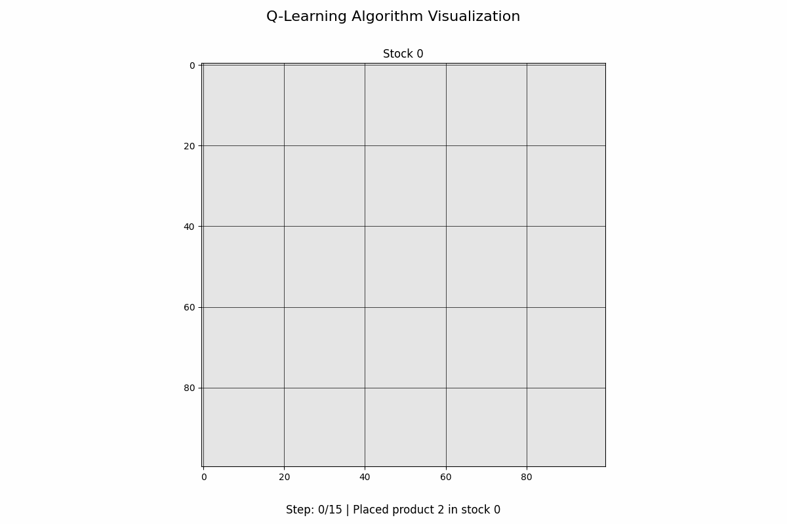
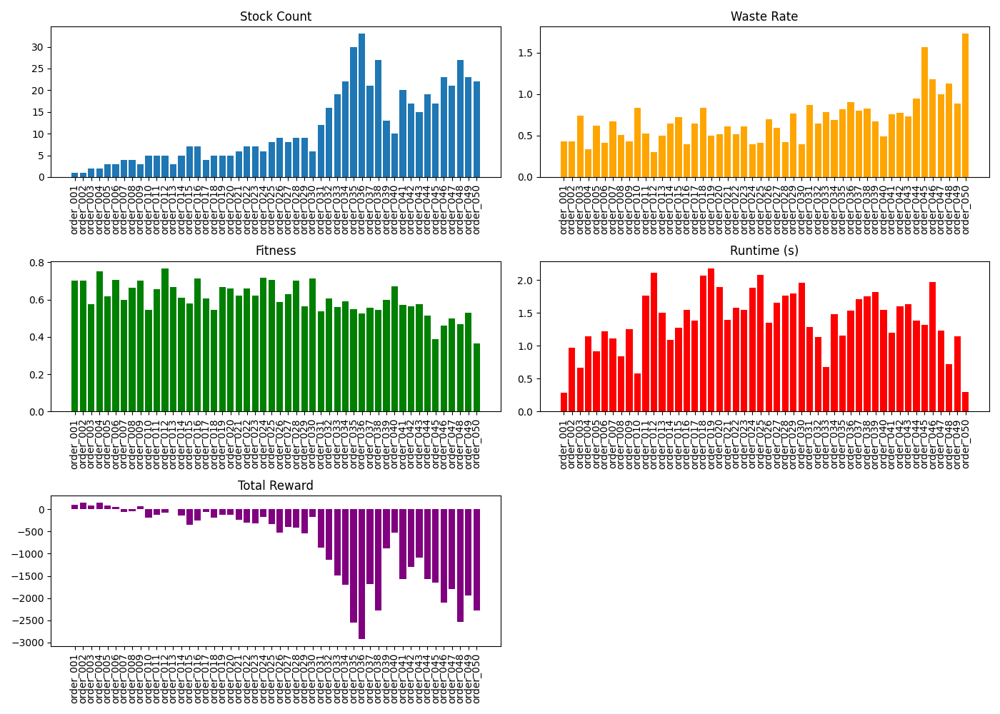

# 🧠 Q-Learning for 2D Cutting Stock Problem

This module presents a detailed implementation of **Q-Learning** applied to the **2D Cutting Stock Problem** (2D-CSP). The goal is to reduce material waste by finding optimal ways to cut stock sheets (e.g., wood, glass) into smaller products such as tables, chairs, and legs.

---

## 🌈 What is Q-Learning?

**Q-Learning** is a model-free reinforcement learning algorithm used to find the optimal action-selection policy in a Markov Decision Process (MDP).

The agent learns by interacting with an environment, updating a **Q-table** that stores the expected reward for taking an action `a` in a state `s`.

It follows the Bellman Equation:

$$
Q(s, a) \leftarrow Q(s, a) + \alpha \left[r + \gamma \max_{a'} Q(s', a') - Q(s, a)\right]
$$

Where:
- \( α \): Learning rate
- \( γ \): Discount factor
- \( r \): Immediate reward
- \( s' \): Next state
- \( a' \): Next action

---

## 🎓 Working Principle of Q-Learning in 2D-CSP

- **State**: Encodes the flattened stock grid and remaining product quantities.
- **Action**: Select a product ID (which has remaining quantity).
- **Reward Function**:
  - Encourage placing items **near the stock edge** or **adjacent to others**.
  - Provide high reward for **placing tables in stock corners**.
  - Bonus for completing the order.
  - Penalty for unused space and using too many stocks.

---

## 📊 Q-Learning Algorithm Steps

```text
1. Initialize Q(s, a) = 0 for all state-action pairs
2. For each episode:
   a. Reset environment and get initial state s
   b. Repeat until done:
       - Choose action a using ε-greedy policy
       - Take action, observe reward r and next state s'
       - Update Q(s, a) using the Bellman formula
       - Set s = s'
```

---

## 🔢 Q-Learning Design Comparison Table

| Feature                | Description                                                                 |
|------------------------|-----------------------------------------------------------------------------|
| **Type**              | Value-based reinforcement learning                                           |
| **Exploration**       | ε-greedy (tunable)                                                         |
| **State Representation** | Flattened grid + product quantity list                                   |
| **Flexibility**       | Discrete action space                                                        |
| **Performance**       | Fast training, decent results, may need tuning                              |
| **Limitations**       | Spatial info loss in tabular Q-table, limited scalability                  |

---

## 🔄 Reward Strategy

| Component                 | Description                                                                 |
|---------------------------|-----------------------------------------------------------------------------|
| **First Table Placement**| +10 if placed in stock corner; else +1                                      |
| **Second Table**         | +8 if adjacent to first and near edge; else +1                              |
| **Other Products**       | +5 if near edge or another product; else +1                                 |
| **Completion Bonus**     | +50 when all products are placed                                             |
| **Trim Loss Penalty**    | -0.01 per empty cell in used stocks                                          |
| **Stock Penalty**        | -50 for each extra stock used                                                |

---

## 📊 Evaluation Metrics

| Metric         | Meaning                                                   |
|----------------|-----------------------------------------------------------|
| **Reward**      | Sum of all rewards during the episode                     |
| **Waste Rate**  | (Unused area) / (Used area)                               |
| **Fitness**     | (Used area) / (Total area of stocks used)                |
| **Runtime**     | Time taken to run one episode                            |
| **Stock Count** | Number of stock sheets used                              |

---

## 🔄 Sample Results Table

| Order ID | Stocks Used | Waste Rate | Fitness | Runtime (s) | Reward |
|----------|-------------|------------|---------|--------------|--------|
| 001      | 1           | 0.3167     | 0.7592  | 0.3241       | 116.0  |
| 002      | 1           | 0.4400     | 0.6944  | 0.3125       | 94.0   |
| 003      | 2           | 0.7407     | 0.5741  | 0.4061       | 66.0   |
| 004      | 1           | 0.3158     | 0.7609  | 0.4042       | 96.0   |

---

## 🔦 Q-Learning in Action

> Upload your Q-learning cutting result GIFs here:

```bash
📁 Q_learning_results/
├── q_learning_order_001_animation.gif
├── q_learning_order_002_animation.gif
├── q_learning_order_003_animation.gif
├── q_learning_order_004_animation.gif
```

Example:
```markdown

```

### 🌀 Q-Learning Visualization Example




---

---

## 🔄 50 orders Benchmark chart



---

## 🎉 Conclusion

Q-Learning provides a fast and interpretable method for solving the 2D cutting stock problem. While it may not always outperform heuristics in small test cases, its adaptability makes it suitable for reinforcement learning research, experimentation, and potential integration into hybrid optimization systems.

---

## 🔧 Run Q-learning

```bash
python test.py
or download test.ipynb
```

Make sure to have the `q_table.pkl` file available, or train using `train.py` if needed.

---

## 📜 Reference

- Sutton & Barto - Reinforcement Learning: An Introduction
- Custom environment based on OpenAI Gym
- Visual analysis with `matplotlib`, `imageio`, `animation`

